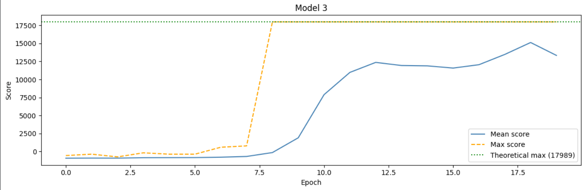

# Flappy Bird Neuroevolution

Training a neural network to play Flappy Bird using neuroevolution — no backpropagation, no reinforcement learning. Just mutation and selection.

**Final result: reached the theoretical maximum score of 17,989 (100 pipes cleared)**

---

## How it works

Instead of gradient descent, this uses a **genetic algorithm**:

1. Spawn a population of birds, each with a randomly initialized neural network brain
2. Let them all play simultaneously
3. Select the elite birds (highest scorers)
4. Clone and mutate their weights to create the next generation
5. Repeat

No gradients. No loss functions. The only feedback is survival.

---

## Neural Network

- **Input:** 4 state features — bird y position, velocity, pipe x distance, relative distance to pipe center
- **Hidden:** 4 neurons (tanh activation)
- **Output:** 1 neuron (tanh activation) — positive = flap, negative = do nothing
- **Total parameters: 25**

The entire model is implemented in pure NumPy — no Keras, no PyTorch.

---

## The 3 Model Iterations

| Model | Architecture | Key Change | Best Score | Final Mean Score |
|---|---|---|---|---|
| Model 1 | 4 → 4(ReLU) → 1(Linear) | Baseline | 3,095 | -326.0 |
| Model 2 | 4 → 4(ReLU) → 1(Sigmoid) | Sigmoid output | 11,884 | -775.16 |
| Model 3 | 4 → 4(Tanh) → 1(Tanh) | Tanh + NumPy batching | **17,989** | **13,839.32** |

---

## Why Tanh over ReLU for neuroevolution

ReLU is problematic here for a specific reason: during gradient descent, dead neurons can be revived via backpropagation. In neuroevolution there is no backpropagation — weights only change through random mutation. A neuron stuck outputting 0 due to negative weights has no recovery mechanism. Tanh keeps all neurons active regardless of input sign, which makes mutation meaningful for every weight in the network.

---

## Key engineering decisions

**Feature engineering** — The original state gave the model the raw pipe gap top position. The final version gives it the *relative distance from the bird's y position to the pipe center*. In gradient descent, the model can learn implicit relationships between inputs. In neuroevolution, that's much harder — providing the relationship directly made convergence significantly faster.

**Vectorised forward pass** — Switched from looping through each bird's Keras model individually to a single batched NumPy forward pass across all 50 birds simultaneously using `einsum`. Drastically faster training epochs.

**Mutation tuning** — After the model reached max score, mutation rate was tightened (0.04) to exploit the current solution rather than explore away from it. Mean score climbed from ~1,800 to ~13,800.

---

## Hyperparameters (final run)

| Parameter | Value |
|---|---|
| Population size | 50 |
| Elite birds | 10 |
| Mutation rate | 0.04 |
| Mutation strength | 0.08 |
| Epochs | 20 + 20 |
| Max pipes (goal) | 100 |

---

## Results

The Model 3 training curve shows the characteristic neuroevolution pattern — flat for many epochs, then a sharp phase transition once the right weights are discovered, followed by the mean score catching up to the max:

- Epochs 1–8: mean score hovering around -900 (birds dying immediately)
- Epoch 9: first bird hits theoretical max (17,989)
- Epochs 10–20: mean score climbs from 1,897 → 13,839

---

## Stack

- Python
- NumPy (neural network + training loop)
- TensorFlow/Keras (Models 1 & 2 only — dropped for Model 3)
- OpenCV (game rendering)
- imageio (video generation)
- Google Colab

---

## Run it yourself

1. Clone the repo
2. Open `FlappyBirdResume.ipynb` in Google Colab
3. Run all cells in order — each model section builds on the last
4. The final cell renders a video of the trained bird clearing all 100 pipes
